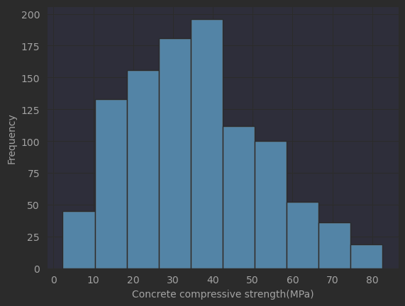
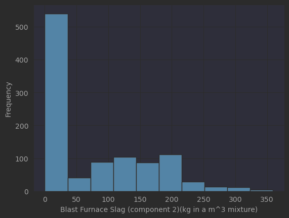
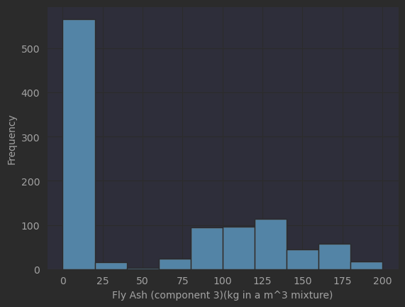
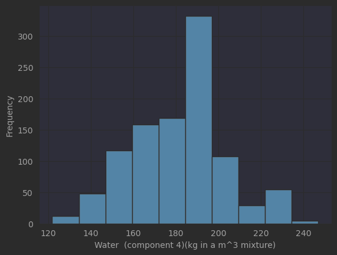
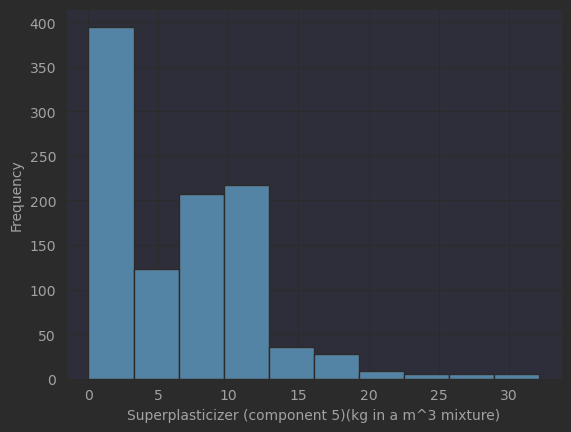
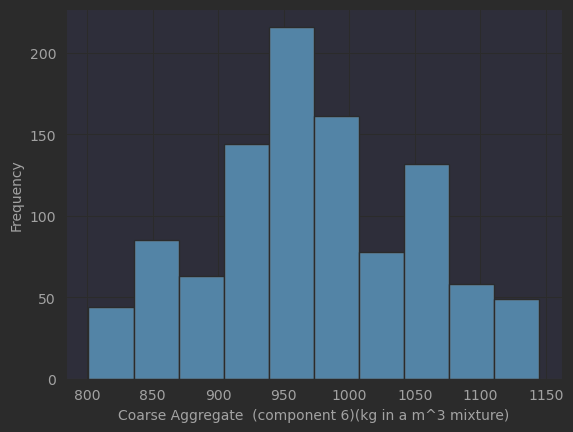
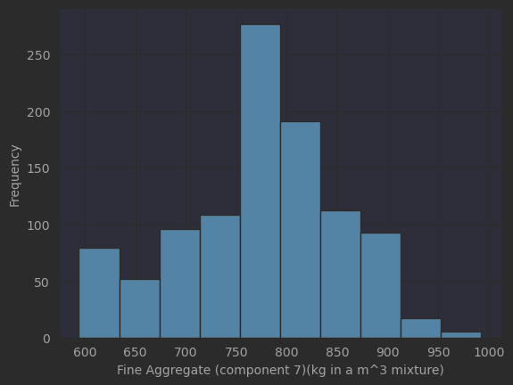
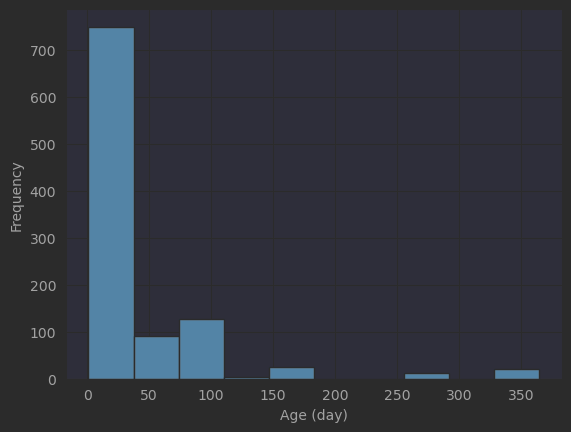
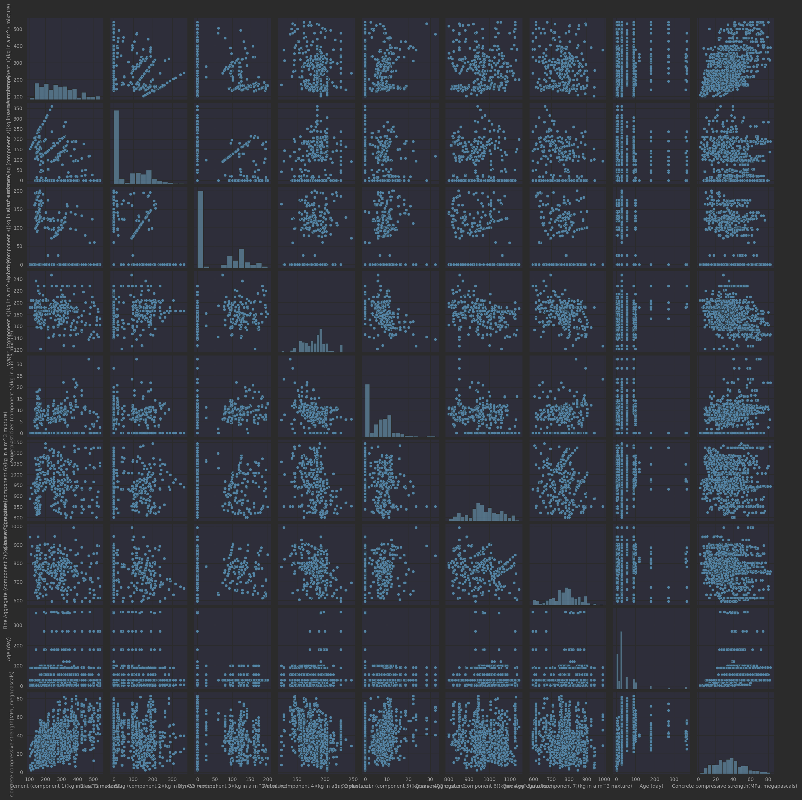

# Prediction of Concrete Compressive Strength

## Descriptive Analysis

### Univariates

|       | Cement \(component 1\)\(kg in a m^3 mixture\) | Blast Furnace Slag \(component 2\)\(kg in a m^3 mixture\) | Fly Ash \(component 3\)\(kg in a m^3 mixture\) | Water  \(component 4\)\(kg in a m^3 mixture\) | Superplasticizer \(component 5\)\(kg in a m^3 mixture\) | Coarse Aggregate  \(component 6\)\(kg in a m^3 mixture\) | Fine Aggregate \(component 7\)\(kg in a m^3 mixture\) | Age \(day\) | Concrete compressive strength\(MPa, megapascals\) |
|:------|----------------------------------------------:|----------------------------------------------------------:|-----------------------------------------------:|----------------------------------------------:|--------------------------------------------------------:|---------------------------------------------------------:|------------------------------------------------------:|------------:|--------------------------------------------------:|
| 25%   |                                    192.375000 |                                                  0.000000 |                                       0.000000 |                                    164.900000 |                                                0.000000 |                                               932.000000 |                                            730.950000 |    7.000000 |                                         23.710000 |
| 50%   |                                    272.900000 |                                                 22.000000 |                                       0.000000 |                                    185.000000 |                                                6.400000 |                                               968.000000 |                                            779.500000 |   28.000000 |                                         34.445000 |
| 75%   |                                    350.000000 |                                                142.950000 |                                     118.300000 |                                    192.000000 |                                               10.200000 |                                              1029.400000 |                                            824.000000 |   56.000000 |                                         46.135000 |
| count |                                   1030.000000 |                                               1030.000000 |                                    1030.000000 |                                   1030.000000 |                                             1030.000000 |                                              1030.000000 |                                           1030.000000 | 1030.000000 |                                       1030.000000 |
| max   |                                    540.000000 |                                                359.400000 |                                     200.100000 |                                    247.000000 |                                               32.200000 |                                              1145.000000 |                                            992.600000 |  365.000000 |                                         82.600000 |
| mean  |                                    281.167864 |                                                 73.895825 |                                      54.188350 |                                    181.567282 |                                                6.204660 |                                               972.918932 |                                            773.580485 |   45.662136 |                                         35.817961 |
| min   |                                    102.000000 |                                                  0.000000 |                                       0.000000 |                                    121.800000 |                                                0.000000 |                                               801.000000 |                                            594.000000 |    1.000000 |                                          2.330000 |
| std   |                                    104.506364 |                                                 86.279342 |                                      63.997004 |                                     21.354219 |                                                5.973841 |                                                77.753954 |                                             80.175980 |   63.169912 |                                         16.705742 |

#### Correlation matrix
|                                                           | Cement \(component 1\)\(kg in a m^3 mixture\) | Blast Furnace Slag \(component 2\)\(kg in a m^3 mixture\) | Fly Ash \(component 3\)\(kg in a m^3 mixture\) | Water  \(component 4\)\(kg in a m^3 mixture\) | Superplasticizer \(component 5\)\(kg in a m^3 mixture\) | Coarse Aggregate  \(component 6\)\(kg in a m^3 mixture\) | Fine Aggregate \(component 7\)\(kg in a m^3 mixture\) | Age \(day\) | Concrete compressive strength\(MPa, megapascals\) |
|:----------------------------------------------------------|----------------------------------------------:|----------------------------------------------------------:|-----------------------------------------------:|----------------------------------------------:|--------------------------------------------------------:|---------------------------------------------------------:|------------------------------------------------------:|------------:|--------------------------------------------------:|
| Cement \(component 1\)\(kg in a m^3 mixture\)             |                                      1.000000 |                                                 -0.275216 |                                      -0.397467 |                                     -0.081587 |                                                0.092386 |                                                -0.109349 |                                             -0.222718 |    0.081946 |                                          0.497832 |
| Blast Furnace Slag \(component 2\)\(kg in a m^3 mixture\) |                                     -0.275216 |                                                  1.000000 |                                      -0.323580 |                                      0.107252 |                                                0.043270 |                                                -0.283999 |                                             -0.281603 |   -0.044246 |                                          0.134829 |
| Fly Ash \(component 3\)\(kg in a m^3 mixture\)            |                                     -0.397467 |                                                 -0.323580 |                                       1.000000 |                                     -0.256984 |                                                0.377503 |                                                -0.009961 |                                              0.079108 |   -0.154371 |                                         -0.105755 |
| Water  \(component 4\)\(kg in a m^3 mixture\)             |                                     -0.081587 |                                                  0.107252 |                                      -0.256984 |                                      1.000000 |                                               -0.657533 |                                                -0.182294 |                                             -0.450661 |    0.277618 |                                         -0.289633 |
| Superplasticizer \(component 5\)\(kg in a m^3 mixture\)   |                                      0.092386 |                                                  0.043270 |                                       0.377503 |                                     -0.657533 |                                                1.000000 |                                                -0.265999 |                                              0.222691 |   -0.192700 |                                          0.366079 |
| Coarse Aggregate  \(component 6\)\(kg in a m^3 mixture\)  |                                     -0.109349 |                                                 -0.283999 |                                      -0.009961 |                                     -0.182294 |                                               -0.265999 |                                                 1.000000 |                                             -0.178481 |   -0.003016 |                                         -0.164935 |
| Fine Aggregate \(component 7\)\(kg in a m^3 mixture\)     |                                     -0.222718 |                                                 -0.281603 |                                       0.079108 |                                     -0.450661 |                                                0.222691 |                                                -0.178481 |                                              1.000000 |   -0.156095 |                                         -0.167241 |
| Age \(day\)                                               |                                      0.081946 |                                                 -0.044246 |                                      -0.154371 |                                      0.277618 |                                               -0.192700 |                                                -0.003016 |                                             -0.156095 |    1.000000 |                                          0.328873 |
| Concrete compressive strength\(MPa, megapascals\)         |                                      0.497832 |                                                  0.134829 |                                      -0.105755 |                                     -0.289633 |                                                0.366079 |                                                -0.164935 |                                             -0.167241 |    0.328873 |                                          1.000000 |

### Histograms

### Pair-plots

