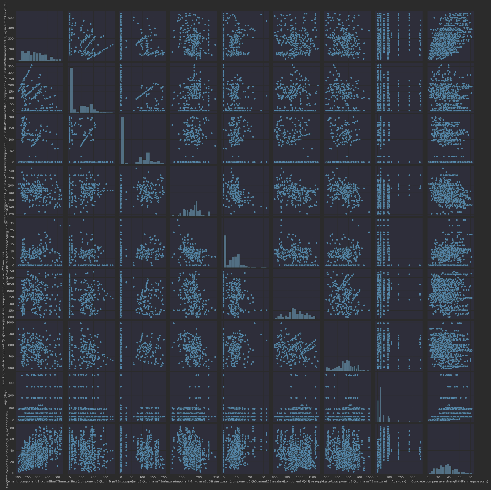

## Prediction of Concrete Compressive Strength

### Descriptive Analysis

#### Univariates

|       | Cement \(component 1\)\(kg in a m^3 mixture\) | Blast Furnace Slag \(component 2\)\(kg in a m^3 mixture\) | Fly Ash \(component 3\)\(kg in a m^3 mixture\) | Water  \(component 4\)\(kg in a m^3 mixture\) | Superplasticizer \(component 5\)\(kg in a m^3 mixture\) | Coarse Aggregate  \(component 6\)\(kg in a m^3 mixture\) | Fine Aggregate \(component 7\)\(kg in a m^3 mixture\) | Age \(day\) | Concrete compressive strength\(MPa, megapascals\) |
|:------|:----------------------------------------------|:----------------------------------------------------------|:-----------------------------------------------|:----------------------------------------------|:--------------------------------------------------------|:---------------------------------------------------------|:------------------------------------------------------|:------------|:--------------------------------------------------|
| 25%   | 192.375000                                    | 0.000000                                                  | 0.000000                                       | 164.900000                                    | 0.000000                                                | 932.000000                                               | 730.950000                                            | 7.000000    | 23.710000                                         |
| 50%   | 272.900000                                    | 22.000000                                                 | 0.000000                                       | 185.000000                                    | 6.400000                                                | 968.000000                                               | 779.500000                                            | 28.000000   | 34.445000                                         |
| 75%   | 350.000000                                    | 142.950000                                                | 118.300000                                     | 192.000000                                    | 10.200000                                               | 1029.400000                                              | 824.000000                                            | 56.000000   | 46.135000                                         |
| count | 1030.000000                                   | 1030.000000                                               | 1030.000000                                    | 1030.000000                                   | 1030.000000                                             | 1030.000000                                              | 1030.000000                                           | 1030.000000 | 1030.000000                                       |
| max   | 540.000000                                    | 359.400000                                                | 200.100000                                     | 247.000000                                    | 32.200000                                               | 1145.000000                                              | 992.600000                                            | 365.000000  | 82.600000                                         |
| mean  | 281.167864                                    | 73.895825                                                 | 54.188350                                      | 181.567282                                    | 6.204660                                                | 972.918932                                               | 773.580485                                            | 45.662136   | 35.817961                                         |
| min   | 102.000000                                    | 0.000000                                                  | 0.000000                                       | 121.800000                                    | 0.000000                                                | 801.000000                                               | 594.000000                                            | 1.000000    | 2.330000                                          |
| std   | 104.506364                                    | 86.279342                                                 | 63.997004                                      | 21.354219                                     | 5.973841                                                | 77.753954                                                | 80.175980                                             | 63.169912   | 16.705742                                         |

#### Pair-plots
